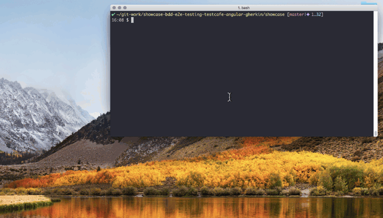

# showcase-bdd-e2e-testing-testcafe-angular-gherkin

Showcase [Testcafe](http://devexpress.github.io/testcafe/) for [Angular](https://angular.io/)

<p align="center"></p>


----

&nbsp;

### Usage Example 1: Testcafe test Angular App served static

We will build our Angular app and serve the `dist` dir via a webserver (express).
Then run the Testcafe E2E tests against that instance.
After the tests are done the webserver is stopped.

```
git clone https://github.com/csgruenebe/showcase-testcafe-e2e-tests-angular.git
cd showcase-testcafe-e2e-tests-angular
npm install 

npm run build
npm run test:e2e
```


----
&nbsp;

### Usage Example 2: Docker

Scenario 1: [Predefined Docker Image](http://devexpress.github.io/testcafe/documentation/using-testcafe/installing-testcafe.html#using-testcafe-docker-image)

Scenario 2: Custom Image


----
&nbsp;

### Further Reading

 * Testcafe witg BDD and Cucumber.js https://github.com/helen-dikareva/testcafe-cucumber-demo


----

&nbsp;

### License

[MIT](./LICENSE) comSysto GmbH
